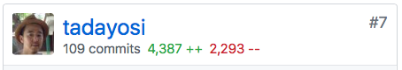
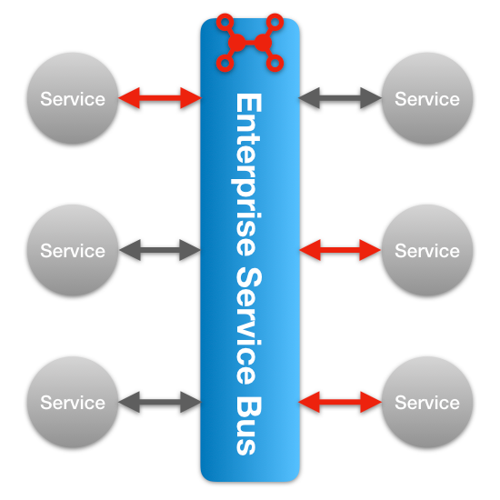
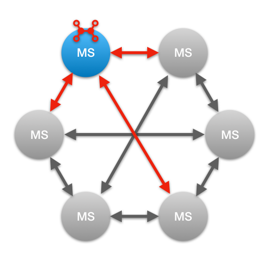
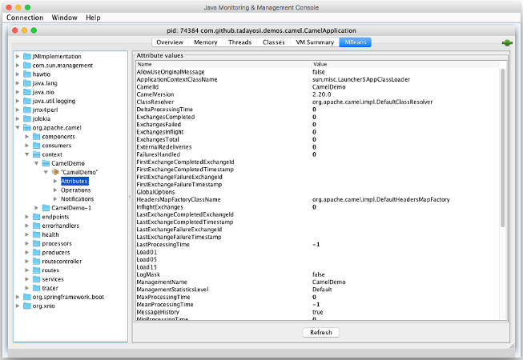

% <small>Apache Camel + hawtio + Spring Boot による</small><br/>モダンなインテグレーション<br/>マイクロサービス  
% <font color="orange">#ccc_c2</font>  
% 2017.11.18  

<section>
<table>
<colgroup><col style="width: 30%" /><col style="width: 70%" /></colgroup>
<tbody>
<tr>
<td style="vertical-align: middle">

<br/>
<small>
Twitter: [\@tadayosi](https://twitter.com/tadayosi)<br/>
GitHub: [tadayosi](https://github.com/tadayosi)
</small>
</td>
<td style="vertical-align: top">
佐藤　匡剛<br/><small>さとう &nbsp;　&nbsp; ただよし</small>

シニアソフトウェアエンジニア  
@ Red Hat

<table>
<tr>
<td style="vertical-align: middle">
- <small>Apache Camel<br/>contributor</small>
</td>
<td>

</td>
</tr>
<tr>
<td style="vertical-align: middle">
- <small>hawtio<br/>committer</small>
</td>
<td>

</td>
</tr>
</table>

</td>
</tr>
</tbody>
</table>
</section>

## Agenda

1. インテグレーションマイクロサービス
2. Apache Camel とは
3. インテグレーションマイクロサービスの作り方
4. hawtio によるモニタリング

## Agenda

1. <font color="orange">**インテグレーションマイクロサービス**</font>
2. Apache Camel とは
3. インテグレーションマイクロサービスの作り方
4. hawtio によるモニタリング

##

<section data-background-image="../images/rh-bg7.jpg">

<h2>インテグレーション<br/>マイクロサービス</h2>

</section>

##

賢いエンドポイントと単純なパイプ  
Smart endpoints and dumb pipes

> <small>"The microservice community favours an alternative approach: <font color="red">smart endpoints and dumb pipes</font>. Applications built from microservices aim to be as decoupled and as cohesive as possible -- they own their own domain logic and act more as filters in the classical Unix sense -- receiving a request, applying logic as appropriate and producing a response. These are choreographed using simple RESTish protocols rather than complex protocols such as WS-Choreography or BPEL or orchestration by a central tool."  
> -- James Lewis & Martin Fowler</small>

<small>
<https://martinfowler.com/articles/microservices.html>
</small>

##

ルーティングロジックがエンドポイントに

<table>
<colgroup><col style="width: 45%" /><col style="width: 10%" /<col style="width: 45%" /></colgroup>
<tr>
<td style="vertical-align: middle; text-align: center">

<small>SOA</small>
</td>
<td style="vertical-align: middle; text-align: center">
vs.
</td>
<td>
<div style="vertical-align: middle; text-align: center">

<small>マイクロサービス</small>
</div>
</td>
</tr>
</table>

## Agenda

1. インテグレーションマイクロサービス
2. <font color="orange">**Apache Camel とは**</font>
3. インテグレーションマイクロサービスの作り方
4. hawtio によるモニタリング

##

<section data-background-color="#ffffff" data-transition="none">

</section>

## Apache Camel

<table>
<colgroup><col style="width: 30%" /><col style="width: 70%" /></colgroup>
<tr>
<td style="vertical-align: middle">

</td>
<td>
<div style="vertical-align: top">

- 軽量なインテグレーション  
  フレームワーク
  - `camel-core.jar` ≈ 4.8M
- 直観的なルーティング DSL
- Enterprise Integration Patterns

</div>
</td>
</tr>
</table>

## Apache Camel

<table>
<colgroup><col style="width: 30%" /><col style="width: 70%" /></colgroup>
<tr>
<td style="vertical-align: middle">

</td>
<td>
<div style="vertical-align: top">

- 280+ の接続コンポーネント
- GUI 開発環境（Eclipse）
- マイクロサービスのサポート
  - Spring Boot / WildFly Swarm
  - Netflix Hystrix

</div>
</td>
</tr>
</table>

## &#128042; Camel でできること &#128042;

1. <font color="orange">HTTP/REST</font> で受け取ったリクエストを <font color="orange">Twitter</font> にツィートする
2. <font color="orange">SOAP</font> で受け取ったリクエストを <font color="orange">Kafka</font> へ流す
3. <font color="orange">ActiveMQ</font> から受け取った JMS メッセージを、データの内容に応じて：
  - <font color="orange">MongoDB</font> に永続化する
  - 別の <font color="orange">Web サービス</font> に投げる
  - <font color="orange">Twilio</font> を使ってスマホに SMS で通知する

## Java DSL

<small><font color="orange">HTTP</font> で受け取ったリクエストを <font color="orange">Twitter</font> にツィートする</small>

```
public class HelloRoute extends RouteBuilder {
  @Override
  public void configure() throws Exception {

    from("undertow:http://localhost:8080/hello")
      .log("name = ${in.header.name}")
      .setBody(simple("Hello, ${in.header.name}! #ccc_c2"))
      .to("twitter-timeline://user")
      .setBody(constant("Success!"));

  }
}
```

## Alt Java でも OK

(Scala)
```
class HelloRoute extends RouteBuilder {
  override def configure: Unit = {

    from("undertow:http://localhost:8080/hello")
      .log("name = ${in.header.name}")
      .setBody(simple("Hello, ${in.header.name}! #ccc_c2"))
      .to("twitter-timeline://user")
      .setBody(constant("Success!"))

  }
}
```

## Spring XML DSL

`<beans> ... </beans>` の中に定義する

```
<camelContext xmlns="http://camel.apache.org/schema/spring">
<route>
  <from uri="undertow:http://localhost:8081/hello" />
  <log message="name = ${in.header.name}" />
  <setBody>
    <simple>Hello, ${in.header.name}! #ccc_c2</simple>
  </setBody>
  <to uri="twitter-timeline://user" />
  <setBody>
    <constant>Success!</constant>
  </setBody>
</route>
</camelContext>
```

##

<section data-background-image="../images/eip.jpg" data-background-size="auto 70%" data-background-position="left">
<table>
<colgroup><col style="width: 40%" /><col style="width: 60%" /></colgroup>
<tbody>
<tr>
<td></td>
<td>
<div style="vertical-align: middle">

**Enterprise Integration Patterns**

- システム間連携のベスト  
  プラクティス
- 65 のデザインパターン


</div>
</td>
</tr>
</tbody>
</table>
</section>

## Content-Based Router


```
from("direct:input")
  .choice()
    .when(header("country").isEqualTo("JP"))
      .to("direct:japan")
    .when(header("country").isEqualTo("US"))
      .to("direct:us")
    .when(header("country").isEqualTo("UK"))
      .to("direct:uk")
    .otherwise()
      .to("direct:other");
```

## 280+ のコンポーネント

<small>
<https://github.com/apache/camel/blob/camel-2.20.0/components/readme.adoc>

|     |     |     |     |     |     |
|-----|-----|-----|-----|-----|-----|
| AWS | Azure | Box | Cassandra | Consul |
| CouchDB | CXF | DigitalOcean | Docker | Dropbox |
| Ehcache | Elasticsearch | Etcd | Facebook | Ganglia |
| GitHub | Google | Hazelcast | Hadoop | Hipchat |
| Ignite | Infinispan | IronMQ  | jBPM | jclouds |
| JIRA | JT400 | Kafka | Kubernetes | LinkedIn |
| Lucene | MongoDB | MQTT | Nagios | OpenStack |
| OptaPlanner | PubNub | RabbitMQ | Salesforce | SAP |
| ServiceNow | Splunk | STOMP | Telegram | Thrift |
| Tika | Twilio | Twitter | Vert.x | Yammer |
| Zendesk | ZooKeeper | ... | | |

</small>

## Eclipse プラグイン


<small>
<http://tools.jboss.org/features/fusetools.html>
</small>

## Agenda

1. インテグレーションマイクロサービス
2. Apache Camel とは
3. <font color="orange">**インテグレーションマイクロサービスの作り方**</font>
4. hawtio によるモニタリング

##

<section data-background-image="../images/rh-bg6.jpg">
<h2>インテグレーション<br/>マイクロサービスの作り方</h2>
</section>

## Camel &#9876; Spring Boot

1. Spring Boot プロジェクトを作成
2. Camel コンポーネント Starter を `pom.xml` に追加
3. `@Component` を付けた Camel ルートを定義

## Camel の Starter を追加

```
<dependencies>
...
<dependency>
  <groupId>org.apache.camel</groupId>
  <artifactId>camel-spring-boot-starter</artifactId>
</dependency>
<dependency>
  <groupId>org.apache.camel</groupId>
  <artifactId>camel-undertow-starter</artifactId>
</dependency>
<dependency>
  <groupId>org.apache.camel</groupId>
  <artifactId>camel-twitter-starter</artifactId>
</dependency>
```

## Camel ルートを定義

```
@Component
public class HelloRoute extends RouteBuilder {

  @Override
  public void configure() throws Exception {
    from("undertow:http://localhost:8080/hello")
      ...
```

## Spring XML の場合

`@ImportResource` で XML を読み込む

```
@SpringBootApplication
@ImportResource("classpath:camel-context.xml")
public class CamelApplication {

    public static void main(String[] args) {
        SpringApplication.run(CamelApplication.class, args);
    }
}
```

## Demo

## Agenda

1. インテグレーションマイクロサービス
2. Apache Camel とは
3. インテグレーションマイクロサービスの作り方
4. <font color="orange">**hawtio によるモニタリング**</font>

##

<section data-background-image="../images/rh-bg8.jpg">
<h2>マイクロサービスを<br/>どうやって監視する？</h2>
</section>

## JVM の監視といえば…<br/><br/>JMX

##

JConsole ...



##

<section data-background-color="#ffffff" data-transition="none">


</section>

##  hawtio

&#128293; Web ベースのイケてる JMX 監視ツール &#128293;

<small style="vertical-align: middle">Made by</small> AngularJS 1.x + Jolokia


## Jolokia

&#127798;&#127798;&#127798; JMX にカプサイシンをぶっ込む &#127798;&#127798;&#127798;


<small>
<https://jolokia.org/reference/html/architecture.html>
</small>

## hawtio &#9876; Spring Boot

`pom.xml` に `dependency` を追加するだけ！

```
<dependencies>

    <!-- hawtio -->
    <dependency>
        <groupId>io.hawt</groupId>
        <artifactId>hawtio-springboot</artifactId>
        <version>1.5.6</version>
    </dependency>

<dependencies>
```

## Demo

##

<section data-background-image="../images/rh-bg2.jpg">

<h2 style="color: black">ラクダ乗りになるには</h2>

</section>

##

<section data-background-image="../images/camel-in-action2.png" data-background-size="auto 70%" data-background-position="left">
<table>
<colgroup><col style="width: 40%" /><col style="width: 65%" /></colgroup>
<tbody>
<tr>
<td></td>
<td>
<div style="vertical-align: middle">

<h3>Camel in Action 2</h3>

<br/>

<font color="orange">**来月（12月）出版予定！**</font>

</div>
</td>
</tr>
</tbody>
</table>
</section>

##

<section data-background-image="../20171118-jjug_camel_hawtio/jcug.jpg">

<h2>Japan Camel User Group<br/>(JCUG)</h2>

<br/><br/><br/>

<https://jcug-oss.github.io>

<font color="orange">**Camel in Action 2 の読書会を開催中！**</font>

<br/>

</section>

##

<section data-background-image="../images/rh-bg4.jpg">
<h1><font color="black">Q & A</font></h1>
</section>

## Thank you!
